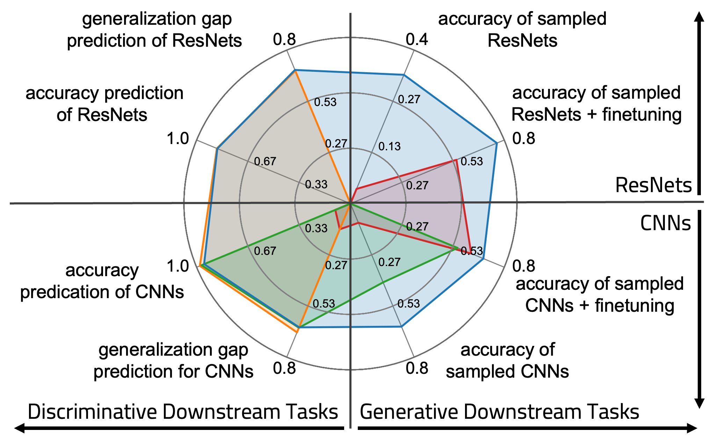
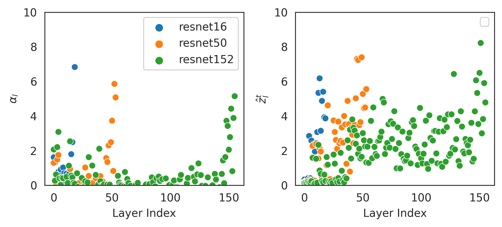

# SANE: Scalable and Versatile Weight Space Learning

This repository contains the code for the paper "Towards Scalable and Versatile Weight Space Learning," presented at ICML 2024. This work introduces SANE*, a novel approach for learning task-agnostic representations of neural networks that are scalable to larger models and applicable to various tasks. The paper can be found here: [ICML proceedings](https://proceedings.mlr.press/v235/schurholt24a.html) | [arxiv](http://arxiv.org/abs/2406.09997).

<sup>*Sequential Autoencoder for Neural Embeddings</sub>

## Summary
Learning representations of well-trained neural network models holds the promise to provide an understanding of the inner workings of those models. However, previous work has faced limitations when processing larger networks or was task-specific to either discriminative or generative tasks. This paper introduces the SANE approach to weight-space learning. SANE overcomes previous limitations by learning task-agnostic representations of neural networks that are scalable to larger models of varying architectures and show capabilities beyond a single task. Our method extends the idea of hyper-representations towards sequential processing of subsets of neural network weights, allowing one to embed larger neural networks as a set of tokens into the learned representation space. SANE reveals global model information from layer-wise embeddings and can sequentially generate unseen neural network models, which was unattainable with previous hyper-representation learning methods. As the figure below shows, extensive empirical evaluation demonstrates that SANE (light blue) matches or exceeds state-of-the-art performance on several weight representation learning benchmarks, particularly in initialization for new tasks and larger ResNet architectures. 



### Key Methods

- **Sequential Decomposition**: Breaking down neural network weights into smaller, manageable token sequences.
- **Self-Supervised Pretraining**: Using a self-supervised approach to pretrain the SANE model on a variety of tasks and architectures on **subsequences of models**.
- **Model Analysis**: Analysing models by their embedding sequences.
- **Model Sampling**: Generating new neural network models by sampling from the learned representation space.

### Results

- **Model Property Prediction**: SANE embeddings demonstrate high predictive performance for model properties such as test accuracy, epoch, and generalization gap across various datasets and architectures.
- **Generative Capabilities**: SANE can generate high-performing neural network models from scratch or fine-tune them with significantly less computational effort compared to training from scratch.
- **Scalability**: The method scales to large models like ResNet-18, preserving meaningful information across long sequences of tokens.

## Code Structure

- **data/**: Scripts for data preprocessing and loading.
- **experiments/**: Example experiments to pre-train SANE on a CIFAR100-ResNet18 zoo, predict propeties and sample models
- **src/**: contains the SANE package to preprocess model checkpoint datasets, pre-train SANE, and perform discriminative and generative downstream tasks.

## Running Experiments
We include code to run example experiments and showcase how to use our code. 

### Download Model Zoo Datasets
We have made several model zoos available at [modelzoos.cc](https://modelzoos.cc/). Any of these zoos can be used in our pipeline, with minor adjustments.  

To get started with a small experiment, navigate to `./data/` and run 
```bash
bash download_cifar10_cnn_sample.sh
```
This will download and unzip a small model zoo example with CNN models trained on CIFAR-10. 
Training on large model zoos requires preprocessing for training efficiency. We provide code to preprocess training samples. To compile those datasets, run
```bash
python3 preprocess_dataset_cnn_cifar10_sample.py
```
in `./data/`. in the same directory, we provide download and preprocessing scripts for other zoos as well. 
The preprocessed datasets have no specific dependency requirements, other than regular numpy and pytorch.

Please note that this is not the exact models used in the paper and will therefore produce different results. The full zoos can be downloaded from [modelzoos.cc](https://modelzoos.cc/) and used in the same way as the zoo sample.  

### Pretraining SANE
Code to pretrain SANE on the sample zoo is contained in `experiments/pretrain_sane_cifar100_resnet18.py`. The code relies on ray.tune to manage resources, but currently only runs a single config. 
To vary any of the configurations, exchange the value with `tune.grid_search([value_1, ..., value_n])`. To run the experiment, run
```
python3 pretrain_sane_cifar100_resnet18.py
```
in `experiments/`

### Using SANE embeddings to predict properties
SANE embeddings preserve the sequential decomposition of models. This enables a more fine-granual analysis of models compared to global model embeddings. The figure below shows a comparison between SANE embeddings (right) and features used in the WeightWatcher library (left), which are based on the eigendecomposition of the weight matrices. Both show similar trends of layer properties in ResNet models, but SANE appears to pick up on additional signals in the middle layers.


We provide code to use SANE embeddings to predict such model properties in `experiments/property_prediction_cifar100_resnet18.py`. It assumes downloaded dataset and pre-trained SANE as described above. Within `property_prediction_cifar100_resnet18.py`, set the path to the pretrained SANE model and epoch. then run
```bash
python3 property_prediction_cifar100_resnet18.py
```
within `experiments`. This will compute the property prediction results from both SANE embeddings and weight-statistic baselines and save them in a `json`.

### Generating Models
Generating models can provide initializations even for new tasks and architectures that give an advantage over random initializations, see the Figure below.


In `experiments`, there is also code to generate and evaluate models. 
`cnn-cifar10_exploration.ipynb` is a quick-start notebook to explore the datasets, SANE models, training loop, as well as encoding and de-coding models. 
We further provide experiment code for the sample dataset of cnns and a larger resnet dataset. For the latter, `sample_finetune_cifar100_resnet18.py` contains an example for model sampling. As above, set the path to a pretrained SANE model and epoch. Then, run
```bash
python3 sample_finetune_cifar100_resnet18.py
```
within `experiments`. Generating models requires a pre-processed CIFAR100 dataset that can be generated by running
```bash
python3 prepare_cifar100_dataset.py
```
The small cnn sample experiment code is structured correspondingly.

## Contact
Feel free to get in touch with us with any questions on the project or to request access to data and / or pretrained models. Reach out to `konstantin.schuerholt@unisg.ch`.

## Citation
If you use this code in your research, please cite our paper:
```
@inproceedings{schuerholt2024sane,
    title={Towards Scalable and Versatile Weight Space Learning},
    author={Konstantin Sch{"u}rholt and Michael W. Mahoney and Damian Borth},
    booktitle={Proceedings of the 41st International Conference on Machine Learning (ICML)},
    year={2024},
    organization={PMLR}
}
```

## License
This project is licensed under the MIT License.
